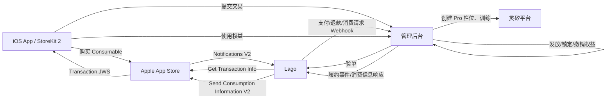
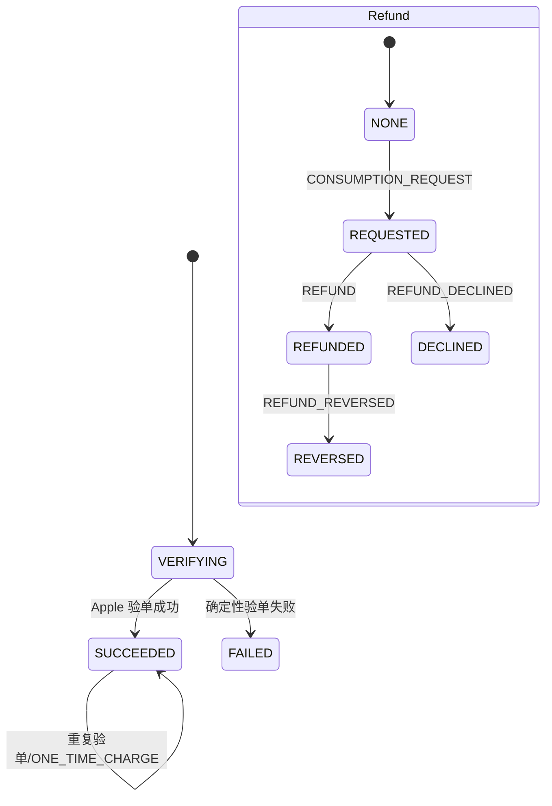
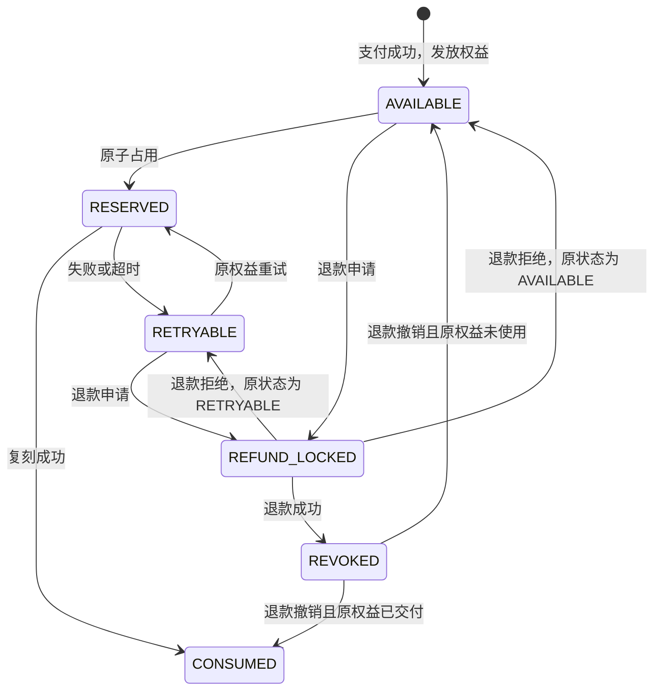
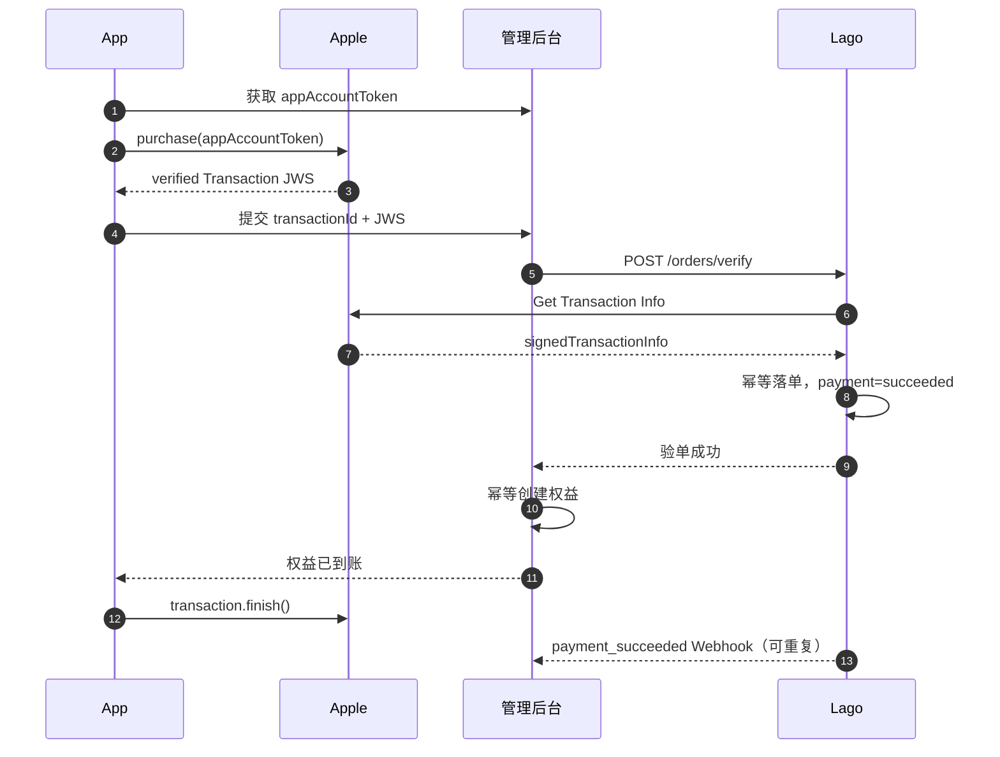
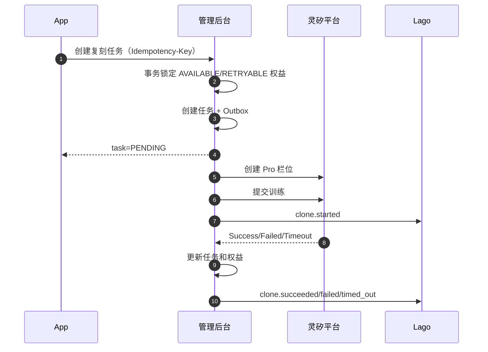
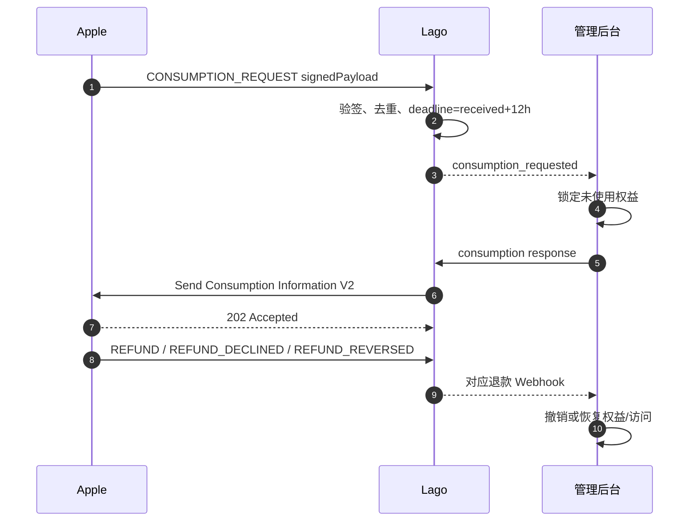

# 付费音色复刻 Apple IAP：Lago 与管理后台接口方案

> 版本基线：2026-07-28
> 适用范围：一期 iOS Consumable 商品，一笔 Apple 交易购买一次 Pro 音色复刻权益
> 相关代码：`lago1/api`、`linx/linx-app-backend/backend`

## 落地状态

本方案已在上述两个仓库完成一期服务端实现：

- Lago：Apple IAP Provider、Apple API JWT Client、固定根证书 JWS 验签、验单/查单接口、
  通知 Inbox、履约与消费信息接口、退款状态、补偿 Job 和签名 Webhook；
- 管理后台：稳定 `appAccountToken`、本地订单/权益、Lago JWT Webhook Inbox、履约/消费
  Outbox、每分钟补偿、验单/查询接口，以及音色创建和训练状态联动；
- 兼容策略：`paid_voice_clone_enabled` 默认是 `0`，关闭时原音色复刻链路不增加付费校验。

代码已完成静态检查；数据库迁移、Apple Sandbox 真单和 Webhook 联调仍属于发布门禁，不能用模拟
JWS 代替最终验收。

### 当前一期实现与目标模型的差异

本文第 5～14 节保留了完整目标模型，便于后续拆分独立权益和复刻任务。当前一期代码采用了更小的
落地范围：

- 管理后台使用 `app_apple_iap_order` 同时保存订单、权益、复刻任务投影，没有拆成
  `purchase/entitlement/task` 三张表；
- Webhook Inbox 为 `app_apple_iap_webhook_event`，可靠 Outbox 为
  `app_apple_iap_outbox`；
- Lago Webhook 实际入口为 `POST /open/apple-iap/webhook`；
- 消费信息回传使用 `response_event_id`、`customer_consented`、履约枚举和
  `backend_snapshot`，由管理后台按真实复刻状态完成映射；
- 音色栏位创建和训练仍沿用 `/app/voice/create`、`/app/voice/train` 两步调用；
- `ONE_TIME_CHARGE` 当前只更新已经由 App 验单主链路登记的订单。通知先于主链路到达时会保留为
  失败事件等待重试，尚未实现未认领订单自动绑定。

发布和联调必须以当前代码接口及第 15～17 节的落地清单为准；目标模型不能当作已经上线的数据库契约。

## 1. 结论

一期建议采用“Apple 交易订单、复刻权益、复刻任务”三对象分治：

- Apple 是资金与退款裁决的事实源。
- Lago 是 Apple 交易、支付状态、退款状态、Apple 通知和消费信息提交的事实源。
- 管理后台是复刻权益、复刻任务和音色交付状态的事实源。
- App 只通过管理后台提交交易、查询权益和使用权益，不直接调用 Lago。

Apple IAP 不应直接套用 Lago 现有的 Invoice/PaymentRequest 收银台模型。现有 `Payment` 模型强依赖
`Invoice` 或 `PaymentRequest`，而 IAP 是 App 已经通过 StoreKit 完成扣款后，由 Lago 验证和登记的外部交易。
一期应新增独立的 `AppleIapOrder` 聚合模型，同时复用支付宝接入已经验证过的 Lago 基础设施：

- `PaymentProvider` 的密钥与环境配置；
- Provider Client；
- 外部通知验签、落库、异步处理；
- Service/Job 分层；
- Lago 出站 Webhook、签名和重试；
- 定时主动查询补偿。

## 2. 当前代码与改造边界

### 2.1 Lago 现状

支付宝链路已经包含以下可复用结构：

| 能力 | 当前实现 |
|---|---|
| Provider 配置 | `PaymentProviders::AlipayProvider` |
| 外部 API Client | `PaymentProviders::Alipay::Client` |
| 支付创建 | `PaymentProviders::Alipay::Payments::CreateService` |
| 支付异步通知 | `HandleIncomingWebhookService`、`HandleEventService` |
| 主动查单补偿 | `SyncPendingService`、`Clock::SyncAlipayPaymentsJob` |
| Lago 出站通知 | `Webhook`、`SendWebhookJob`、`SendHttpWebhookJob` |

Apple 接入复用结构，不复用以下支付宝业务语义：

- Lago 不为 Apple 创建收银台或发起扣款；
- 不创建 PSP Customer 或 Payment Method；
- 不接入 `Invoices::Payments::*` 和 `PaymentRequests::Payments::*`；
- 不把 Apple IAP 订单硬塞进现有 `payments` 表。

### 2.2 管理后台现状

当前免费复刻链路为：

1. `AppVoiceService#createVoice` 立即调用灵矽 `/v1/voice-clones` 创建栏位；
2. `AppVoiceService#trainVoice` 调用 `/v1/voice-clones/{voiceId}` 开始训练；
3. `syncCloneVoiceStates` 主动同步 `Init/Training/Success/Failed`。

付费链路不能只在现有 Controller 前增加一次“已支付”判断。并发请求可能重复通过检查并创建多个 Pro
栏位。需要新增权益和任务实体，在数据库事务中原子占用权益；灵矽外部调用在事务提交后异步执行。

## 3. 总体架构



### 3.1 主链路和补偿链路

- 主链路：App 取得 StoreKit Transaction JWS 后，经管理后台调用 Lago 同步验单。
- 支付补偿：Lago 处理 Apple `ONE_TIME_CHARGE` 通知；管理后台按
  `appAccountToken` 或 `transactionId` 幂等补发权益。
- 超时补偿：管理后台按 `business_request_id` 查询 Lago 订单。
- 通知补偿：Lago 使用 Get Notification History 拉取遗漏的 V2 通知。
- 订单补偿：Lago 对 `VERIFYING` 订单调用 Get Transaction Info。
- 履约补偿：管理后台对未回传成功的履约 Outbox 重试。

## 4. 关键业务标识

| 标识 | 生成方 | 用途 | 唯一约束 |
|---|---|---|---|
| `business_request_id` | 管理后台 | 一次验单请求幂等 | Lago 组织内唯一 |
| `transaction_id` | Apple | 一次 Apple 交易 | `bundle_id + environment + transaction_id` 唯一 |
| `original_transaction_id` | Apple | 交易链原始标识 | 查询与审计 |
| `app_account_token` | 管理后台 | 将 Apple 交易绑定本地用户 | UUID；后台用户稳定映射 |
| `lago_order_id` | Lago | Lago IAP 订单主键 | 全局 UUID |
| `event_id` | 事件生产方 | 业务事件幂等 | 接收方唯一 |
| `notification_uuid` | Apple | Apple V2 通知幂等 | Lago 全局唯一 |
| `entitlement_id` | 管理后台 | 一次复刻权益 | 全局 UUID |
| `clone_task_id` | 管理后台 | 一次复刻任务 | 全局 UUID |

App 发起 StoreKit 购买时必须设置 `appAccountToken(UUID)`。该 UUID 由管理后台生成和保存，不使用可枚举的
用户 ID。Lago 验单必须确认 Apple 签名交易中的 `appAccountToken` 与管理后台传入值一致。

## 5. 数据模型

### 5.1 Lago

#### `apple_iap_orders`

| 字段 | 说明 |
|---|---|
| `id` | `lago_order_id`，UUID |
| `organization_id` | Lago 组织 |
| `payment_provider_id` | Apple IAP Provider |
| `business_request_id` | 管理后台验单请求 ID |
| `external_customer_id` | 管理后台用户 ID 的字符串表达 |
| `app_account_token` | Apple 与本地用户的绑定 UUID |
| `transaction_id` | Apple 当前交易 ID |
| `original_transaction_id` | Apple 原始交易 ID |
| `product_id` | IAP Product ID |
| `bundle_id`、`app_apple_id` | App 身份 |
| `environment` | `sandbox` / `production`，以 Apple 签名内容为准 |
| `product_type` | 一期必须为 `Consumable` |
| `quantity` | 一期必须为 `1` |
| `price_milliunits`、`currency` | 仅展示与排障，不用于财务对账 |
| `purchase_at`、`verified_at` | 购买与验单时间 |
| `payment_status` | `verifying/succeeded/failed` |
| `refund_status` | `none/requested/succeeded/declined/reversed/manual_review` |
| `fulfillment_status` | `not_reported/entitlement_granted/processing/delivered/failed/timed_out` |
| `fulfillment_version` | 管理后台履约快照的单调递增版本 |
| `signed_transaction` | Apple JWS，加密存储或按安全策略归档 |
| `failure_code`、`failure_message` | 验单失败原因 |
| `revocation_date`、`revocation_reason`、`revocation_percentage` | Apple 退款/撤销信息 |
| `metadata` | 非查询型扩展信息 |

索引：

- 唯一：`organization_id + business_request_id`；
- 唯一：`bundle_id + environment + transaction_id`；
- 普通：`app_account_token`、`external_customer_id`、`payment_status`、`refund_status`；
- 禁止同一 `transaction_id` 被绑定到不同用户。

#### `apple_iap_notifications`

保存 Apple 原始通知和处理状态：

- `notification_uuid` 唯一；
- `notification_type`、`subtype`、`environment`；
- `transaction_id`、`apple_iap_order_id`；
- `signed_payload`；
- `status = pending/processing/succeeded/failed/ignored`；
- `received_at`、`processed_at`、`attempts`、`last_error`。

#### `apple_iap_fulfillment_events`

保存管理后台回传的履约事件：

- `event_id` 唯一；
- `apple_iap_order_id`；
- `fulfillment_version`；
- `event_type`、`entitlement_status`、`clone_status`；
- `entitlement_id`、`clone_task_id`、`voice_id`、`attempt_no`；
- `failure_code`、`failure_message`、`occurred_at`；
- 原始请求快照。

#### `apple_iap_consumption_requests`

- `notification_uuid` 唯一并关联 Apple 通知；
- `apple_iap_order_id`、`transaction_id`；
- `deadline_at`；
- `status = awaiting_backend/ready/sending/sent/skipped_no_consent/failed/expired`；
- 管理后台回传的权益与履约快照；
- 发给 Apple 的 `deliveryStatus`、`consumptionPercentage`、`refundPreference`、
  `sampleContentProvided`、`customerConsented`；
- Apple 响应和最后错误。

### 5.2 管理后台

#### `app_apple_iap_purchase`

保存管理后台对 Lago 订单的本地投影：

- `userId`、`businessRequestId`、`lagoOrderId`；
- `transactionId`、`productId`、`appAccountToken`；
- `paymentStatus`、`refundStatus`；
- `lastLagoVersion`、`lastEventAt`；
- `transactionId`、`businessRequestId`、`lagoOrderId` 分别唯一。

#### `app_voice_clone_entitlement`

| 字段 | 说明 |
|---|---|
| `id` | 权益 UUID |
| `userId` | 所属用户 |
| `lagoOrderId`、`transactionId` | 支付来源 |
| `status` | `AVAILABLE/RESERVED/RETRYABLE/CONSUMED/REFUND_LOCKED/REVOKED` |
| `preRefundStatus` | 退款锁定前状态，用于拒绝/撤销退款后的恢复 |
| `reservedTaskId` | 当前占用任务 |
| `version` | 乐观锁版本 |
| `reservedAt`、`consumedAt`、`revokedAt` | 生命周期时间 |

约束：

- `transactionId` 唯一，一笔交易只创建一个权益；
- 一个权益同时只能关联一个非终态任务；
- 退款锁定或撤销状态禁止新任务占用。

#### `app_voice_clone_task`

- `id`、`userId`、`entitlementId`；
- `businessRequestId`，用户维度唯一；
- `voiceId`；
- `status = PENDING/CREATING_SLOT/TRAINING/SUCCEEDED/FAILED/TIMED_OUT/CANCELED`；
- `attemptNo`；
- 音频地址、语言、名称等业务参数；
- `failureCode`、`failureMessage`；
- `lastFulfillmentEventId`、`lastReportedAt`。

#### `app_lago_webhook_inbox` 与 `app_lago_outbox`

- Inbox 以 `X-Lago-Unique-Key` 唯一，先持久化再返回 2xx，业务异步处理；
- Outbox 保存管理后台向 Lago 的履约事件，发送成功前持续重试；
- 不在业务事务中直接依赖跨系统 HTTP 成功。

## 6. 状态模型

支付、退款、履约是三个正交状态，不能压缩成单一 `order_status`。



管理后台权益状态：



规则：

- `payment_status=SUCCEEDED` 在退款后仍保持成功，退款由 `refund_status` 表达；
- `REFUND` 的权限动作优先级高于迟到的履约成功事件；
- `REFUND_REVERSED` 才能恢复因退款撤销的权益或音色访问；
- 一期只自动处理全额退款。`revocationPercentage` 非 `100000` 时进入 `manual_review`，
  不自动拆分一个不可分割的复刻权益。

## 7. 接口设计

以下路径使用 `apple-iap`；Rails 内部资源名可使用 `apple_iap_orders`。

### 7.1 管理后台 → Lago：Apple 交易验单

`POST /api/v1/apple-iap/orders/verify`

Headers：

```http
Authorization: Bearer <LAGO_API_KEY>
Idempotency-Key: 018f6d8a-...
Content-Type: application/json
```

Request：

```json
{
  "apple_iap_order": {
    "business_request_id": "018f6d8a-bd53-7a4d-9d54-e261bd9b0c20",
    "external_customer_id": "12345",
    "app_account_token": "e4451b3e-6708-47c3-a6e9-e078e620ba40",
    "transaction_id": "2000001234567890",
    "product_id": "com.linx.voice_clone.pro.once",
    "signed_transaction": "eyJhbGciOiJFUzI1NiIsIng1YyI6Wy..."
  }
}
```

处理：

1. 校验 API Key、`Idempotency-Key` 与 `business_request_id` 一致；
2. 校验 JWS `ES256` 签名和 `x5c` 证书链；
3. 校验交易 JWS 的 `bundleId` 和 `productId` 白名单；`appAppleId` 在通知外层数据存在时校验；
4. 校验 `type=Consumable`、`quantity=1`；
5. 校验 JWS 中的 `transactionId`、`productId` 与请求一致；
6. 校验 `appAccountToken` 与请求一致；
7. 根据签名内容中的环境调用 Apple Get Transaction Info；
8. 验证 Apple 返回的 `signedTransactionInfo`，确认未被退款/撤销；
9. 幂等创建或更新订单并在事务提交后发送支付成功事件。

Apple API 超时或可重试错误时，不返回业务失败；订单保留为 `verifying` 并返回 HTTP 202。

Response（验证完成）：

```json
{
  "apple_iap_order": {
    "lago_order_id": "a698e610-1e8c-41ae-97f9-5dc2f41b2ce9",
    "business_request_id": "018f6d8a-bd53-7a4d-9d54-e261bd9b0c20",
    "transaction_id": "2000001234567890",
    "original_transaction_id": "2000001234567890",
    "product_id": "com.linx.voice_clone.pro.once",
    "environment": "production",
    "payment_status": "succeeded",
    "refund_status": "none",
    "fulfillment_status": "not_reported",
    "version": 1,
    "verified_at": "2026-07-28T08:12:31Z"
  }
}
```

Response（处理中，HTTP 202）：

```json
{
  "apple_iap_order": {
    "lago_order_id": "a698e610-1e8c-41ae-97f9-5dc2f41b2ce9",
    "business_request_id": "018f6d8a-bd53-7a4d-9d54-e261bd9b0c20",
    "payment_status": "verifying",
    "retry_after_seconds": 3
  }
}
```

错误码：

| HTTP | code | 含义 |
|---|---|---|
| 400 | `invalid_request` | 缺字段或格式错误 |
| 401/403 | `unauthorized/forbidden` | 服务鉴权失败 |
| 409 | `idempotency_conflict` | 同一幂等键对应不同请求 |
| 409 | `transaction_already_claimed` | 交易已绑定其他用户 |
| 422 | `invalid_signed_transaction` | JWS 或证书链无效 |
| 422 | `bundle_mismatch` | App 身份不匹配 |
| 422 | `product_not_allowed` | Product ID 不在白名单 |
| 422 | `app_account_token_mismatch` | 交易与用户绑定不匹配 |
| 422 | `transaction_revoked` | 验单时交易已经退款/撤销 |

幂等行为：

- 同一幂等键、同一请求返回同一订单；
- 同一交易、同一用户、不同请求 ID 返回既有订单；
- 同一交易、不同用户返回 409，绝不重新绑定。

### 7.2 管理后台 → Lago：权益及复刻履约回传

`POST /api/v1/apple-iap/orders/{lago_order_id}/fulfillment-events`

Request：

```json
{
  "fulfillment_event": {
    "event_id": "cc3a5ab6-69bd-40bf-b3eb-b13d77812be8",
    "fulfillment_version": 4,
    "event_type": "clone.succeeded",
    "occurred_at": "2026-07-28T08:20:41Z",
    "entitlement": {
      "id": "f75e60e3-2fd3-4bfa-a83e-706af99c270f",
      "status": "CONSUMED"
    },
    "clone_task": {
      "id": "7bc67829-ae5c-42b0-aa0c-41809a280641",
      "status": "SUCCEEDED",
      "attempt_no": 1,
      "voice_id": "voice_01K1..."
    }
  }
}
```

`event_type`：

- `entitlement.granted`
- `entitlement.reserved`
- `clone.started`
- `clone.succeeded`
- `clone.failed`
- `clone.timed_out`
- `entitlement.restored`
- `entitlement.revoked`

失败/超时事件增加：

```json
{
  "failure": {
    "code": "LINX_TRAIN_TIMEOUT",
    "message": "voice clone did not reach a terminal state in 30 minutes",
    "retryable": true
  }
}
```

规则：

- `event_id` 幂等；
- `fulfillment_version` 必须单调递增；
- 同版本相同内容返回 200，不同内容返回 409；
- 旧版本返回 409 `stale_fulfillment_version`；
- Lago 校验状态迁移，不允许 `delivered` 被普通迟到事件降级；
- 退款成功后仍保存迟到的履约事实，但不得自动恢复权限或修改退款状态。

### 7.3 管理后台 → Lago：消费信息请求响应

该接口属于履约回传的专用子资源。

`PUT /api/v1/apple-iap/orders/{lago_order_id}/consumption-requests/{notification_uuid}`

Request：

```json
{
  "consumption_response": {
    "event_id": "1e354ede-5405-453e-9e20-850096ff865f",
    "customer_consented": true,
    "sample_content_provided": true,
    "entitlement_status": "REFUND_LOCKED",
    "clone_status": "NOT_STARTED",
    "occurred_at": "2026-07-28T09:01:10Z"
  }
}
```

管理后台只回传真实业务状态和用户同意，不直接决定 Apple 字段。Lago 根据统一策略映射
`deliveryStatus`、`consumptionPercentage` 和 `refundPreference`，防止两个系统的退款口径漂移。

若用户没有有效同意：

```json
{
  "consumption_response": {
    "event_id": "1e354ede-5405-453e-9e20-850096ff865f",
    "customer_consented": false,
    "sample_content_provided": true,
    "entitlement_status": "REFUND_LOCKED",
    "clone_status": "NOT_STARTED",
    "occurred_at": "2026-07-28T09:01:10Z"
  }
}
```

Lago 将请求标记为 `skipped_no_consent`，不调用 Apple。Apple 当前接口要求
`customerConsented=true`，用户不同意时不应提交。

### 7.4 Lago → 管理后台：支付、退款和消费请求通知

管理后台提供：

`POST /internal/integrations/lago/apple-iap/events`

复用 Lago Webhook Headers：

```http
X-Lago-Signature: <RS256 JWT 或 HMAC>
X-Lago-Signature-Algorithm: jwt
X-Lago-Unique-Key: <webhook_delivery_id>
Content-Type: application/json
```

Body：

```json
{
  "webhook_type": "apple_iap.payment_succeeded",
  "object_type": "apple_iap_order",
  "organization_id": "68ebc904-...",
  "event": {
    "event_id": "f3532377-cc20-4814-8683-3eac26753a50",
    "occurred_at": "2026-07-28T08:12:31Z",
    "apple_notification_uuid": null
  },
  "apple_iap_order": {
    "lago_order_id": "a698e610-1e8c-41ae-97f9-5dc2f41b2ce9",
    "business_request_id": "018f6d8a-bd53-7a4d-9d54-e261bd9b0c20",
    "external_customer_id": "12345",
    "app_account_token": "e4451b3e-6708-47c3-a6e9-e078e620ba40",
    "transaction_id": "2000001234567890",
    "product_id": "com.linx.voice_clone.pro.once",
    "payment_status": "succeeded",
    "refund_status": "none",
    "fulfillment_status": "not_reported",
    "version": 1
  }
}
```

事件类型：

| Webhook | 管理后台动作 |
|---|---|
| `apple_iap.payment_succeeded` | 幂等创建订单投影和一个权益 |
| `apple_iap.payment_failed` | 更新支付失败，不发权益 |
| `apple_iap.consumption_requested` | 原子锁定未使用权益，回传消费信息 |
| `apple_iap.refund_succeeded` | 撤销权益；停止未开始任务；处理已交付音色访问 |
| `apple_iap.refund_declined` | 按 `preRefundStatus` 恢复权益 |
| `apple_iap.refund_reversed` | 恢复权益或已交付音色访问 |

`consumption_requested` 增加：

```json
{
  "consumption_request": {
    "notification_uuid": "6d4b...",
    "reason": "UNINTENDED_PURCHASE",
    "received_at": "2026-07-28T09:00:00Z",
    "deadline_at": "2026-07-28T21:00:00Z"
  }
}
```

响应约定：

- 管理后台必须先将原始请求写入 Inbox，再返回 200/204；
- 签名错误返回 401；
- 临时故障返回 5xx，让 Lago 重试；
- 重复 `X-Lago-Unique-Key` 返回 200/204；
- 业务处理失败不能通过返回 2xx 后丢弃，需在 Inbox 中进入可重试状态。

### 7.5 管理后台 → Lago：订单状态查询

按 Lago Order ID：

`GET /api/v1/apple-iap/orders/{lago_order_id}`

超时后按业务请求或 Apple 交易查询：

`GET /api/v1/apple-iap/orders/lookup?business_request_id=...`

`GET /api/v1/apple-iap/orders/lookup?transaction_id=...&environment=production`

查询条件必须且只能提供一个主标识。响应：

```json
{
  "apple_iap_order": {
    "lago_order_id": "a698e610-1e8c-41ae-97f9-5dc2f41b2ce9",
    "business_request_id": "018f6d8a-bd53-7a4d-9d54-e261bd9b0c20",
    "transaction_id": "2000001234567890",
    "product_id": "com.linx.voice_clone.pro.once",
    "environment": "production",
    "payment_status": "succeeded",
    "refund_status": "none",
    "fulfillment_status": "delivered",
    "fulfillment_version": 4,
    "version": 7,
    "verified_at": "2026-07-28T08:12:31Z",
    "updated_at": "2026-07-28T08:20:41Z"
  }
}
```

用途：

- 验单 HTTP 超时后，先按 `business_request_id` 查询，禁止直接换 ID 重建订单；
- 管理后台定时核对本地投影与 Lago 状态；
- Webhook 长时间未到时主动拉取；
- 客服按 `transaction_id` 核对。

## 8. 业务时序

### 8.1 正常购买



App 只在管理后台已经持久化权益后调用 `finish()`。App 崩溃或响应丢失时，StoreKit 未完成交易会再次出现；
重复提交由 `transactionId` 幂等。

### 8.2 `ONE_TIME_CHARGE` 支付补偿

Apple 当前 V2 通知会为 Consumable、Non-consumable 和 Non-renewing Subscription 的一次性购买发送
`ONE_TIME_CHARGE`。处理方式：

1. Lago 验证通知 JWS；
2. 按 `transactionId` Upsert 订单；
3. 若交易尚未通过 App 主链路绑定，使用 `appAccountToken` 标记为可认领订单；
4. 向管理后台发送 `payment_succeeded`；
5. 管理后台用 `appAccountToken` 映射用户并幂等发权益；
6. App 后续再提交同一交易时返回同一订单。

如果通知中没有 `appAccountToken`，Lago 保存未认领订单，不向任意用户发权益；等待 App 提交交易认领。

### 8.3 使用权益与复刻



数据库事务只做：

- `SELECT ... FOR UPDATE` 锁权益；
- 校验权益状态；
- 写 `RESERVED`；
- 创建任务；
- 写 Outbox。

事务内不调用灵矽或 Lago。

### 8.4 退款



## 9. Apple 消费信息 V2 映射

当前接口：

`PUT /inApps/v2/transactions/consumption/{transactionId}`

三项必填：

- `customerConsented`
- `deliveryStatus`
- `sampleContentProvided`

两项可选：

- `consumptionPercentage`
- `refundPreference`

建议的一期二元消费策略：

| 管理后台真实状态 | deliveryStatus | consumptionPercentage | refundPreference |
|---|---|---:|---|
| 权益已发放但未开始 | `DELIVERED` | `0` | `GRANT_FULL` |
| 已占用/复刻进行中但未成功 | `DELIVERED` | `0` | `GRANT_FULL` |
| 复刻成功 | `DELIVERED` | `100000` | `DECLINE` |
| 复刻失败（质量问题） | `UNDELIVERED_QUALITY_ISSUE` | `0` | `GRANT_FULL` |
| 灵矽或本方服务超时/中断 | `UNDELIVERED_SERVER_OUTAGE` | `0` | `GRANT_FULL` |
| 其他未交付 | `UNDELIVERED_OTHER` | `0` | `GRANT_FULL` |

说明：

- 单次复刻是不可分割服务，一期不人为构造 50% 等中间比例；
- Apple 最终决定退款，`refundPreference` 只是开发者偏好；
- `deliveryStatus != DELIVERED` 时，`consumptionPercentage` 必须为 `0`；
- 必须在收到 `CONSUMPTION_REQUEST` 后 12 小时内提交；
- 内部告警建议设在 30 分钟、6 小时、10 小时和 11 小时 30 分；
- 未取得有效同意时不调用 Apple，也不能把 `customerConsented=false` 发给 Apple；
- 不使用 ATT 弹窗取得该同意，应使用独立、明确的消费数据共享同意。

## 10. Apple 通知处理

Lago 的 Apple 回调：

`POST /webhooks/apple_iap/{organization_id}?code={provider_code}`

处理原则：

1. Controller 只读取 `signedPayload`；
2. 验证外层 JWS 后再信任 `notificationUUID/type/data`；
3. 验证内层 `signedTransactionInfo`；
4. 校验交易 JWS 的 `bundleId/environment`，并在通知外层字段存在时校验 `appAppleId`；
5. 按 `notificationUUID` 幂等落库；
6. 入队成功即返回 200；
7. 重复通知返回 200；
8. 无效签名返回 400；
9. 未识别的新通知类型保存为 `ignored` 并告警，不因枚举新增让整个回调 500。

事件处理：

| Apple notificationType | Lago 动作 |
|---|---|
| `TEST` | 记录测试结果，返回 200 |
| `ONE_TIME_CHARGE` | Upsert 支付成功订单，触发支付成功 Webhook |
| `CONSUMPTION_REQUEST` | 退款状态设为 requested，创建 12 小时任务，通知管理后台 |
| `REFUND` | 保存 revocation 字段，退款状态设为 succeeded，通知管理后台 |
| `REFUND_DECLINED` | 退款状态设为 declined，通知管理后台恢复 |
| `REFUND_REVERSED` | 退款状态设为 reversed，通知管理后台恢复 |

生产环境 Apple V2 通知失败后会重试；Sandbox 通常只有一次发送，因此 Sandbox 也必须依赖
Get Notification History 和主动查询测试恢复能力。

## 11. 安全设计

### 11.1 Apple → Lago

- 只接受 HTTPS/TLS 1.2+；
- JWS 算法固定为 `ES256`；
- 校验 `x5c` 证书链到本地固定的 Apple Root CA；
- 校验证书有效期，生产建议启用在线吊销检查；
- 校验外层通知和内层交易 JWS；
- 校验 Provider 配置中的 `bundleId/environment`，并在 Apple 通知包含该字段时校验 `appAppleId`；
- `notificationUUID` 防重放。

不能只 Base64 解码 JWS 后读取字段。

Lago 是 Ruby 服务，现有 Gemfile 已包含 `jwt`，但 Apple 官方 App Store Server Library 当前没有 Ruby 版本。
一期可在 `VerifySignedDataService` 中使用 `jwt + OpenSSL::X509::Store` 实现 ES256 与证书链校验，并满足：

- Apple Root CA 作为本地固定信任锚，不信任 JWS 自带的任意根证书；
- 完整验证叶子证书、中间证书、有效期和签名；
- 使用验证后的叶子证书公钥校验 JWS；
- 使用 Apple 官方 Server Library 测试数据和项目自有篡改用例做交叉测试；
- 上线前安排独立安全评审。

不建议直接引入未经审计的第三方 Ruby IAP Gem 来替代证书链验证。

### 11.2 Lago → Apple

- App Store Server API JWT 使用 App Store Connect In-App Purchase Key；
- Header：`alg=ES256`、`kid=<key_id>`；
- Claims：`iss`、`iat`、`exp`、`aud=appstoreconnect-v1`、`bid`；
- `exp-iat` 不超过 60 分钟，建议每次请求生成 5 分钟 Token；
- 私钥保存在 Lago 加密 `secrets`，禁止写日志和返回 API。

### 11.3 管理后台 → Lago

- 使用独立 Lago API Key；
- 新增最小权限资源 `apple_iap_order`；
- HTTPS；
- `Idempotency-Key`；
- 对请求体大小、JWS 长度和频率限流；
- 日志只记录哈希或尾号，不记录完整 JWS/私钥。

### 11.4 Lago → 管理后台

- 复用 Lago `X-Lago-Signature`；
- JWT 模式校验 RS256 签名、`iss`，并确认 Token 内 `data` 与 HTTP Body 相同；
- 或使用组织级 HMAC；
- `X-Lago-Unique-Key` 防重放；
- 先落 Inbox 后返回 2xx；
- Webhook 公钥缓存，签名失败时刷新一次以支持轮换。

## 12. 并发、幂等和乱序

### 12.1 同一交易重复提交

- 数据库唯一键是最终防线；
- 不依赖 Redis 锁作为唯一保障；
- 同用户返回既有订单和权益；
- 不同用户返回冲突并记录安全告警。

### 12.2 Webhook 早于验单请求

- `ONE_TIME_CHARGE` 可先按交易和 `appAccountToken` 建单；
- 后续 `/verify` 认领并补齐 `business_request_id/external_customer_id`；
- 不重复创建订单或权益。

### 12.3 退款与复刻并发

- 管理后台处理 `CONSUMPTION_REQUEST` 时对权益行加锁；
- `AVAILABLE/RETRYABLE` 进入 `REFUND_LOCKED`；
- 已经 `RESERVED/TRAINING` 的任务保存真实状态，禁止伪报未使用；
- `REFUND` 到达后，迟到的 `clone.succeeded` 只能更新履约事实，不能恢复权限；
- `REFUND_REVERSED` 才能恢复。

### 12.4 Webhook 乱序

- Lago 订单有聚合 `version`；
- 管理后台保存 `lastLagoVersion`；
- 小于当前版本的事件只审计、不回滚状态；
- Apple 最终退款事件优先级高于普通履约事件；
- 每种状态仍执行合法迁移校验，不能只比较时间戳。

## 13. 超时与补偿

### 13.1 管理后台

- 验单 HTTP 超时：按同一 `business_request_id` 查询，再使用同一幂等键重试；
- 202：App 短轮询管理后台，后台轮询 Lago；
- Webhook Inbox：指数退避，达到阈值进入死信和告警；
- 履约 Outbox：1m、5m、15m、1h 重试，成功前不删除；
- 每分钟扫描长时间 `PENDING/CREATING_SLOT/TRAINING` 任务；
- 每 5 分钟核对 `payment=verifying`、`refund=requested` 的本地投影。

### 13.2 Lago

- `VERIFYING` 订单：1m、5m、15m、1h 主动 Get Transaction Info；
- Apple 429/5xx：指数退避和抖动；
- 消费信息：内部 deadline 提前 30 分钟，避免卡在 Apple 的 12 小时边界；
- Webhook 使用现有 Lago 重试与手工重放能力；
- 周期性 Get Notification History：
  - 生产保存游标和时间水位；
  - Sandbox 主动拉取，因为通知失败不重试；
  - Apple 历史结果可能不是当前状态，订单终态核对应再调用交易查询接口。

## 14. 退款后的业务动作

一期建议：

| 场景 | 管理后台动作 |
|---|---|
| 权益未使用 | 撤销权益 |
| 任务排队未调用灵矽 | 取消任务并撤销权益 |
| 任务正在执行 | 记录退款；尽力取消；不得伪造未履约状态 |
| 复刻已成功 | 权益保持“已消费事实”，同时标记退款撤销访问 |
| REFUND_DECLINED | 恢复退款锁定前状态 |
| REFUND_REVERSED | 恢复权益或音色访问 |

已成功音色不建议直接硬删除：

- 先增加访问状态并从 App 可用列表隐藏；
- 异步执行灵矽删除或停用；
- 保留审计记录；
- 具体删除时限以付费条款、隐私政策和声音数据保留策略为准。

## 15. 代码落点

### 15.1 `lago-api`

建议新增：

```text
app/models/
  apple_iap_order.rb
  apple_iap_notification.rb
  apple_iap_fulfillment_event.rb
  apple_iap_consumption_request.rb
  payment_providers/apple_iap_provider.rb

app/controllers/
  api/v1/apple_iap/orders_controller.rb
  api/v1/apple_iap/fulfillment_events_controller.rb
  api/v1/apple_iap/consumption_requests_controller.rb

app/services/payment_providers/apple_iap/
  client.rb
  verify_signed_data_service.rb
  orders/verify_service.rb
  orders/sync_service.rb
  notifications/create_service.rb
  notifications/process_service.rb
  consumption_requests/send_service.rb

app/jobs/payment_providers/apple_iap/
  process_notification_job.rb
  sync_order_job.rb
  send_consumption_information_job.rb

app/services/webhooks/apple_iap/
  payment_succeeded_service.rb
  payment_failed_service.rb
  consumption_requested_service.rb
  refund_succeeded_service.rb
  refund_declined_service.rb
  refund_reversed_service.rb
```

需要修改：

- `config/routes.rb`；
- `WebhooksController`；
- `SendWebhookJob::WEBHOOK_SERVICES`；
- `config/webhook_event_types.yml`；
- `ApiKey::RESOURCES`；
- Provider GraphQL 配置与 Serializer；
- 时钟任务配置；
- 对应迁移、Factory、Request/Service/Job/Webhook specs。

Apple Provider 配置：

- secrets：`issuer_id`、`key_id`、`private_key`；
- settings：`bundle_id`、`app_apple_id`、允许的 `product_ids`；
- Production/Sandbox API Base URL 由交易环境选择；
- Production 与 Sandbox 订单保存在同表但唯一键包含环境。

### 15.2 `linx-app-backend`

建议新增：

```text
backend/src/modules/app/entity/
  apple-iap-purchase.ts
  voice-clone-entitlement.ts
  voice-clone-task.ts
  lago-webhook-inbox.ts
  lago-outbox.ts

backend/src/modules/app/service/
  lago-apple-iap.ts
  voice-clone-purchase.ts
  voice-clone-entitlement.ts
  voice-clone-task.ts

backend/src/modules/app/controller/app/
  apple-iap.ts
  voice-clone.ts

backend/src/modules/app/controller/
  internal/lago-apple-iap.ts

backend/src/modules/app/schedule/
  apple-iap-reconcile.ts
  voice-clone-task-reconcile.ts
  lago-outbox.ts
```

需要修改：

- `backend/src/entities.ts`：生产环境显式注册新实体；
- `AppVoiceService`：Pro 复刻只能由已占用权益的任务编排服务调用；
- 原 `/app/voice/create` 免费路径需要按产品开关隔离，避免绕过付费；
- App 查询接口返回支付、权益、任务和退款投影；
- 增加 TypeORM 唯一索引和事务锁；
- 增加 Contract/Service/并发/补偿测试。

已落地 App 侧业务接口：

- `GET /app/apple-iap/context`：取得稳定 `appAccountToken`；
- `POST /app/apple-iap/consumption-consent`：保存消费数据共享同意；
- `POST /app/apple-iap/verify`：向管理后台提交 StoreKit 2 签名交易；
- `GET /app/apple-iap/order`：按业务请求 ID 或交易号查询；
- `POST /app/voice/create`：开关开启后增加 `appleIapBusinessRequestId`，事务锁定一次权益。

## 16. 发布顺序

1. 确认 Product ID、Bundle ID、App Apple ID 和 59 元 Consumable 商品；
2. 创建 App Store Connect In-App Purchase Key；
3. 在 Lago API 容器挂载 Apple 官方 Root CA，设置
   `APPLE_ROOT_CA_PATHS=/run/secrets/apple-root-ca-g3.pem`，执行
   `20260728163242_create_apple_iap_orders.rb`；
4. 调用 `PUT /api/v1/payment_providers/apple_iap/apple-iap` 配置
   `issuer_id`、`key_id`、P8 私钥、Bundle ID、App Apple ID 和 Product ID 白名单；
5. 管理后台执行
   `backend/migrations/20260728_v1.2.3_create_apple_iap_tables.sql`，配置
   `LAGO_API_URL`、`LAGO_API_KEY`、`LAGO_APPLE_IAP_PROVIDER_CODE` 和
   `LAGO_WEBHOOK_PUBLIC_KEY`；
6. 为管理后台创建只含 `apple_iap_order:read/write` 的独立 Lago API Key；
7. 在 Lago 创建 JWT Webhook Endpoint
   `https://<admin-host>/open/apple-iap/webhook`，订阅六个 `apple_iap.*` 事件；
8. 在 App Store Connect 将 Notifications V2 URL 配成
   `https://<lago-host>/webhooks/apple_iap/<organization_id>?code=apple-iap`；
9. 保持 `paid_voice_clone_enabled=0`，先联调验单、状态查询、Inbox 和 Outbox；
10. 管理后台上线订单投影、权益和任务模型；
11. 使用 Request Test Notification 验证回调；
12. Sandbox 验证购买、重复提交、App 崩溃恢复；
13. 验证消费请求、退款成功、退款拒绝和退款撤销；
14. 验证 Get Notification History、验单超时和 Webhook 丢失补偿；
15. 小流量将 `paid_voice_clone_enabled` 改为 `1`，监控 12 小时消费信息 SLA。

管理后台还需按产品结论设置 `apple_iap_sample_content_provided`；默认 `0`，不会在未确认时向
Apple 声明已提供样例内容。

## 17. 必测用例

- 同一交易连续提交 10 次，只产生一个订单和一个权益；
- 同一交易被另一个用户提交，返回冲突；
- 同一幂等键携带不同交易，返回冲突；
- Apple JWS 被篡改、证书链无效、Bundle/Product 不匹配；
- Sandbox 交易错误地请求 Production 后正确回退或按签名环境路由；
- `/verify` 成功但响应丢失，通过查询恢复；
- `ONE_TIME_CHARGE` 先于 App 提交；
- Webhook 重复、乱序、延迟；
- 同时发起两个复刻任务，只允许一个占用权益；
- 退款申请与权益占用并发；
- 复刻成功晚于 REFUND；
- REFUND_DECLINED 恢复原状态；
- REFUND_REVERSED 恢复访问；
- 无用户同意时不调用消费信息 API；
- 消费信息在 12 小时内发送，Apple 202 后幂等收敛；
- Apple 429/5xx、Lago 5xx、管理后台 5xx、灵矽超时；
- Sandbox 通知丢失后通过历史查询恢复。

## 18. 上线前待确认

以下业务参数不能由技术实现自行推断：

1. 最终 Product ID；
2. `sampleContentProvided` 的真实取值；
3. 用户消费信息共享同意的产品交互和保存时点；
4. 复刻进行中时是否支持尽力取消；
5. 退款成功后已完成音色是停用、隐藏还是删除，以及数据保留期；
6. 灵矽 `QN_ACV` 是否就是 Pro 模型，还是需要新的 `model_id`；
7. 复刻失败允许重试次数和超时时间；
8. 一期是否接受 Apple 的部分退款；本方案默认转人工；
9. Lago 管理界面一期是否必须同步上线。

## 19. 官方参考

- [Lago Custom payment integration](https://getlago.com/docs/integrations/payments/custom-payment-integration)
- [Lago Payment methods](https://getlago.com/docs/guide/payments/payment-methods)
- [Apple Get Transaction Info](https://developer.apple.com/documentation/appstoreserverapi/get-transaction-info)
- [Apple App Store Server Notifications V2](https://developer.apple.com/documentation/appstoreservernotifications/app-store-server-notifications-v2)
- [Apple notificationType](https://developer.apple.com/documentation/appstoreservernotifications/notificationtype)
- [Apple Send Consumption Information](https://developer.apple.com/documentation/appstoreserverapi/send-consumption-information)
- [Apple ConsumptionRequest](https://developer.apple.com/documentation/appstoreserverapi/consumptionrequest)
- [Apple Get Notification History](https://developer.apple.com/documentation/appstoreserverapi/get-notification-history)
- [Apple Generating JSON Web Tokens for API requests](https://developer.apple.com/documentation/appstoreserverapi/generating-json-web-tokens-for-api-requests)
- [Apple Receiving App Store Server Notifications](https://developer.apple.com/documentation/appstoreservernotifications/receiving-app-store-server-notifications)
- [Apple Responding to App Store Server Notifications](https://developer.apple.com/documentation/appstoreservernotifications/responding-to-app-store-server-notifications)
